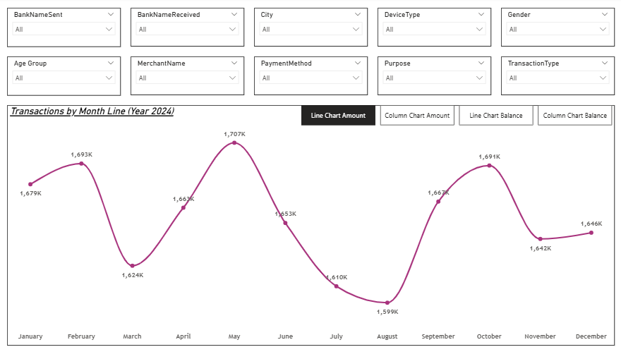
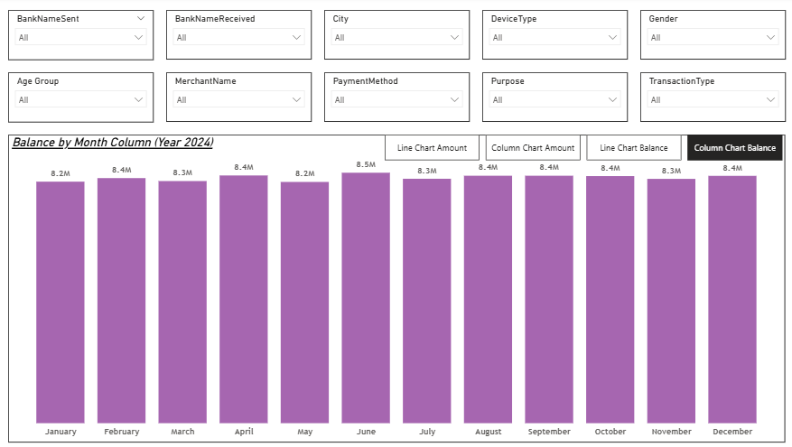
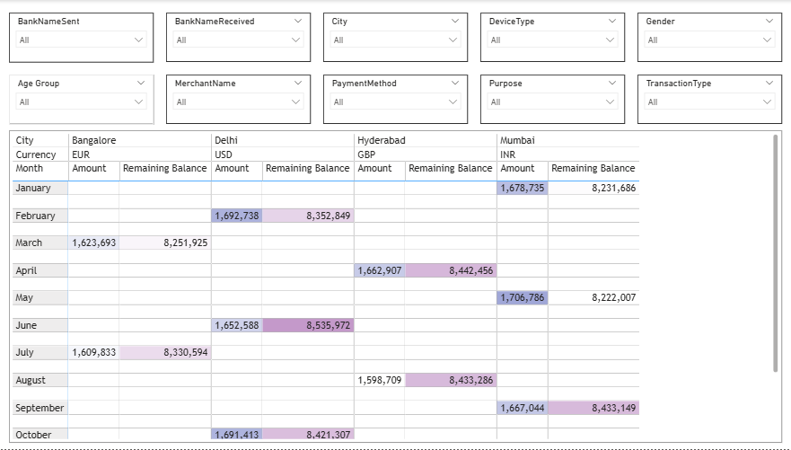

# 📊 UPI Transactions Analytics Report

## Executive Summary

Designed and implemented a KPI-driven financial analytics report in Power BI to analyze 20,000 UPI transactions (~₹19.8M total transaction volume) across 2024.

The objective was to translate transactional payment data into structured, performance-oriented insights covering transaction throughput, balance behavior, operational success rates, and regional concentration patterns.

---

## Dataset Overview

- Total Records: 20,000  
- Total Transaction Volume: ~₹19.8M  
- Average Transaction Value: ~₹993  
- Transaction Success Rate: 80%  
- Time Horizon: Year 2024  

### Dimensions Covered

- City  
- Bank (Sender & Receiver)  
- Merchant  
- Device Type  
- Gender  
- Transaction Type  
- Payment Method  

The dataset was validated and standardized prior to modeling to ensure aggregation accuracy and reporting consistency.

---

## Data Modeling & KPI Framework

A structured semantic layer was developed using DAX measures to support scalable reporting and dynamic slicing.

### Core KPIs Implemented

- Total Transaction Volume  
- Monthly Transaction Aggregation  
- Average Transaction Value  
- Account Balance Trend  
- Success vs Failure Distribution  
- City-Level Contribution Breakdown  

All measures are fully responsive to multi-dimensional filters without compromising performance.

---

# 📊 Dashboard Preview

## 1️⃣ Monthly Transaction Volume – Column View

---

## 2️⃣ Monthly Transaction Volume – Line Analysis

---

## 3️⃣ Monthly Account Balance – Column View

---

## 4️⃣ Monthly Account Balance – Line Analysis

---

## 5️⃣ City-Wise Transaction & Balance Breakdown

---

## Analytical Focus Areas

### Transaction Volume Dynamics
Monthly transaction volume ranged between ~1.6M–1.7M, indicating stable digital payment throughput with observable seasonal variance.

### Balance Movement Analysis
Balance trends highlight cyclical monthly fluctuations, enabling liquidity pattern tracking and comparative performance assessment.

### Regional Concentration
Major urban centers (Delhi, Bangalore, Mumbai, Hyderabad) account for a significant share of transaction activity, reflecting regional adoption density.

### Operational Performance
An 80% success rate reveals measurable operational exposure (20% failure), providing visibility into system-level performance dynamics.

### Behavioral Segmentation
Merchant and device-level filtering enables behavioral usage comparison across transaction channels.

---

## Report Architecture

The report is structured to support exploratory and executive-level analysis:

- Monthly transaction trend visualization (Line & Column views)  
- Monthly account balance monitoring  
- City-wise transaction & balance matrix breakdown  
- Multi-dimensional filtering (City, Bank, Merchant, Device, Gender)  
- Bookmark-driven dynamic chart switching  

The design prioritizes clarity, scalability, and decision-relevant insight.

---

## Technology Stack

- Power BI Desktop  
- Power Query (Data Transformation)  
- DAX (Data Analysis Expressions)  
- Microsoft Excel (Source Data)

---

## Repository Contents

- PBIX file (Full interactive report)  
- Screenshots (Key analytical views)  
- Dataset (Excel format)  
- README documentation  

---

## Conclusion

This implementation demonstrates the ability to engineer KPI-driven financial reporting using Power BI, structure transactional datasets for scalable analytics, and convert digital payment records into performance-oriented business insights.
